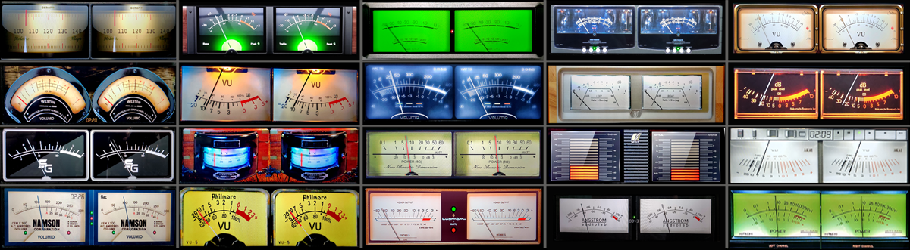

# 515 Templates

VU Meter templates for PeppyMeter Screensaver.

---

## 1920x515_g5_901_mbasic

| Property | Value |
|----------|-------|
| Template Pack | Yes (20 templates) |
| Meter Type | circular |
| Extended Config | Yes |
| Spectrum | No |
| Album Art | Yes |

**Included Meters:**

- 01G5_BlackBlur ONLY
- 02G5_Naim ONLY
- 03G5_Sansui Ver ONLY
- 04G5_Luxman ONLY
- 05G5_Angstrom only
- 06G5_NAD only meters
- 07G5_Audio Research Only
- 08G5_Hitachi7500 ONLY
- 09G5_Kenwood Rev ONLY
- 10G5_Dark Spot Only
- 11G5_DF202 Only
- 12G5_Tonnica ONLY
- 13G5_Eher ONLY
- 14G5_Weston ONLY
- 15G5_SG ONLY
- 16G5_Gemonti ONLY
- 17G5_Philmore Only
- 18G5_Namson Only
- 19G5_Nakamichi only
- 20G5_AKAI Rev

**Download:** [1920x515_g5_901_mbasic.zip](1920x515_g5_901_mbasic.zip)

**Install:** Extract and copy folder to `/data/INTERNAL/peppy_screensaver/templates/`

---

## Installation

1. Download the desired template zip(s)
2. Extract each to the path shown next to its download link
3. Select in plugin settings

---

*Part of [PeppyMeter Templates](https://github.com/foonerd/peppy_templates)*
