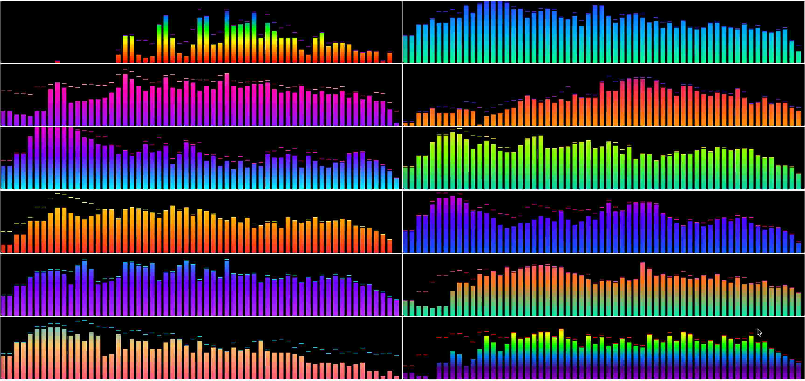

# 480 Templates

Spectrum Analyzer templates.

---

## 1920x480_gradients_kcaudio

| Property | Value |
|----------|-------|
| Template Pack | Yes (12 templates) |
| Meter Type | spectrum |
| Extended Config | No |
| Spectrum | Yes |
| Album Art | No |

**Included Meters:**

- kcaudio_1920_green_blue
- kcaudio_1920_purple_pink
- kcaudio_1920_sunset
- kcaudio_1920_cyan_magenta
- kcaudio_1920_teal_lime
- kcaudio_1920_red_gold
- kcaudio_1920_night_sky
- kcaudio_1920_neon_violet
- kcaudio_1920_mint_sunset
- kcaudio_1920_coral_aqua
- kcaudio_1920_rainbow
- kcaudio_1920_rainbow_reverse

**Download:** [1920x480_gradients_kcaudio.zip](1920x480_gradients_kcaudio.zip)

**Install:** Extract and copy folder to `/data/INTERNAL/peppy_screensaver/templates_spectrum/`

---

## Installation

1. Download the desired template zip(s)
2. Extract each to the path shown next to its download link
3. Select in plugin settings

---

*Part of [PeppyMeter Templates](https://github.com/foonerd/peppy_templates)*
